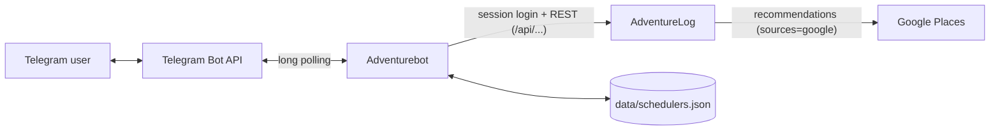

# Adventurebot

[](https://github.com/t0mer/Adventurebot/actions/workflows/docker-image.yml)
[](https://hub.docker.com/r/techblog/adventurebot)
[](LICENSE)

A private Telegram bot for your self-hosted [AdventureLog](https://github.com/seanmorley15/AdventureLog) instance. Browse trips, view location details, manage checklists, discover nearby places, and get daily reminders — all from Telegram.

---

## Table of Contents

- [Features](#features)
- [How It Works](#how-it-works)
- [Requirements](#requirements)
- [Installation](#installation)
  - [Run with Python](#run-with-python)
  - [Run with Docker Compose (recommended)](#run-with-docker-compose-recommended)
  - [Run with `docker run`](#run-with-docker-run)
- [Configuration](#configuration)
- [Usage](#usage)
- [Screenshots](#screenshots)
- [Schedulers](#schedulers-1)
- [Project Structure](#project-structure)
- [AdventureLog Compatibility](#adventurelog-compatibility)
- [Security Notes](#security-notes)
- [Troubleshooting](#troubleshooting)
- [Development](#development)
- [Contributing](#contributing)
- [License](#license)

---

## Features

- **My Trips** — list all collections (with their date ranges) and drill into any trip for locations, transportation, calendar, and checklists
- **Locations** — step through a trip's itinerary stop by stop (visits sorted by start date), browse a paged list of its locations (8 per page), or search them by name
- **Transportation** — step through a trip's flights, trains, drives, and other transport legs
- **Calendar** — view a trip's events (locations plus transportation) sorted by date
- **Location detail** — name, rating, description, coordinates, and one-tap buttons for Apple Maps / Google Maps and turn-by-turn navigation
- **Documents** — download a location's attachments straight into the chat
- **Checklists** — browse, tick off, remove, and add items in any checklist of a trip
- **Recommendations nearby** — up to 10 Google Places results around a saved location (from its location card) or around your current position (from a trip, by sharing your Telegram location); filter by Food, Lodging, or Tourism; choose a radius of 5, 10, 20, or 50 km
- **Search** — keyword search across all locations and collections (trips)
- **Where was I on…** — look up which location you were visiting on a given date
- **Schedulers** — a daily checklist reminder and an evening digest of tomorrow's plans, each with its own time and timezone
- **Private access** — restrict the bot to an allowlist of Telegram chat IDs (`ALLOWED_IDS`); without it, anyone can use the bot
- **Clear sign-in errors** — AdventureLog login failures are logged and reported in the chat instead of showing up as empty results

---

## How It Works



- The bot uses **long polling** (no webhook, no inbound port needed) via [python-telegram-bot](https://python-telegram-bot.org/).
- It signs in to AdventureLog with a username and password (`POST /login`), keeps the `sessionid` cookie, and re-authenticates automatically when the session expires.
- Data is read from the AdventureLog REST API (`/api/collections`, `/api/locations`, `/api/visits`, `/api/transportations`, `/api/checklists`, `/api/search`, `/api/recommendations/query`). Checklist changes are written back with `PATCH /api/checklists/{id}/`.
- Nearby recommendations are served by AdventureLog's own recommendations endpoint, which the bot queries with `sources=google`.
- Scheduler settings are stored in a small JSON file (`data/schedulers.json` by default) and run on the python-telegram-bot job queue.

---

## Requirements

- Python 3.12+ (when not using Docker)
- A running AdventureLog instance (v0.11 or newer <!-- TODO: verify minimum version -->) — see the [official installation guide](https://adventurelog.app/docs/install/getting_started.html)
- An AdventureLog user account that owns the trips you want to see
- A Telegram bot token from [@BotFather](https://t.me/BotFather)
- For **Recommendations nearby**: Google-backed recommendations must work on your AdventureLog instance <!-- TODO: verify which AdventureLog setting (e.g. a Google Maps API key) enables /api/recommendations/query with sources=google -->

---

## Installation

### Run with Python

1. Clone the repo:

   ```bash
   git clone https://github.com/t0mer/Adventurebot.git
   cd Adventurebot
   ```

2. Install dependencies:

   ```bash
   pip install -r requirements.txt
   ```

3. Configure the environment — copy the example file and fill in your values (see [Configuration](#configuration)):

   ```bash
   cp env.example .env
   ```

4. Run the bot:

   ```bash
   python3 -m bot.main
   ```

   To keep it running in the background with tmux:

   ```bash
   tmux new-session -d -s adventurebot 'python3 -m bot.main'
   ```

   To attach and check logs:

   ```bash
   tmux attach -t adventurebot
   ```

### Run with Docker Compose (recommended)

Images are published to Docker Hub as [`techblog/adventurebot`](https://hub.docker.com/r/techblog/adventurebot) (`linux/amd64`, `linux/arm64`).

1. Create a `.env` file next to [`docker-compose.yml`](docker-compose.yml) (see [Configuration](#configuration)).
2. Pull the image and start the container:

   ```bash
   docker compose up -d
   ```

The compose file reads `TELEGRAM_TOKEN`, `AL_URL`, `AL_USERNAME`, `AL_PASSWORD`, and `ALLOWED_IDS` from your `.env` file. It does not pass `TZ` or `SCHEDULER_CONFIG`; add them under `environment:` if you need them. Scheduler settings are persisted in a local `data/` directory mounted at `/app/data` (see [Troubleshooting](#scheduler-settings-are-not-saved-docker) for permissions).

View the logs:

```bash
docker compose logs -f
```

### Run with `docker run`

```bash
docker run -d \
  --name adventurebot \
  --restart unless-stopped \
  -e TELEGRAM_TOKEN=your_token \
  -e AL_URL=https://adventure.example.com \
  -e AL_USERNAME=admin \
  -e AL_PASSWORD=secret \
  -e ALLOWED_IDS=123456789 \
  -v "$(pwd)/data:/app/data" \
  techblog/adventurebot:latest
```

View the logs:

```bash
docker logs -f adventurebot
```

A manual workflow ([`publish-ghcr.yml`](.github/workflows/publish-ghcr.yml)) can also publish the image to the GitHub Container Registry as `ghcr.io/t0mer/adventurebot` (including `linux/arm/v7`).

---

## Configuration

All configuration is done through environment variables. When running with Python, a `.env` file in the working directory is loaded automatically (via `python-dotenv`); variables already set in the environment take precedence over `.env`.

| Variable | Required | Default | Description |
|---|:---:|---|---|
| `TELEGRAM_TOKEN` | ✓ | — | Bot token from @BotFather. |
| `AL_URL` | ✓ | — | Full URL of your AdventureLog instance, e.g. `https://adventure.example.com` (a trailing `/` is ignored). |
| `AL_USERNAME` | ✓ | — | AdventureLog username. |
| `AL_PASSWORD` | ✓ | — | AdventureLog password. Quote it in `.env` if it contains `#`, `!`, or `$` (see [Troubleshooting](#password-with-special-characters-gets-mangled-in-env)). |
| `ALLOWED_IDS` | | *(empty — everyone)* | Comma-separated numeric Telegram chat IDs that may use the bot. Leave empty to allow everyone. Find your chat ID by messaging [@userinfobot](https://t.me/userinfobot). |
| `TZ` | | `UTC` | Fallback timezone for schedulers that have no timezone set. |
| `SCHEDULER_CONFIG` | | `data/schedulers.json` | Path of the JSON file that stores scheduler settings (relative to the working directory; `/app/data/schedulers.json` in Docker). Must be a real environment variable — it is read at import time, before `.env` is loaded, so setting it in `.env` has no effect. |

The bot exits at startup with a `KeyError` if any required variable is missing.

Example `.env`:

```env
TELEGRAM_TOKEN=123456:ABCdefGHIjklMNOpqrSTUvwxYZ
AL_URL=https://adventure.example.com
AL_USERNAME=admin
AL_PASSWORD='secret'
ALLOWED_IDS=367468362,112233445
```

---

## Usage

### Commands

| Command | Description |
|---|---|
| `/start` | Open the main menu. Also registers this chat as the target for scheduler messages. |
| `/schedulers` | Open the scheduler settings directly. |

Everything else is driven by inline buttons.

### Main menu

- **My Trips** → pick a trip → **📍 Locations**, **✈️ Transportation**, **📅 Calendar**, **📋 Checklists**, or **🔍 Recommendations nearby**. Locations, Transportation, and Checklists appear only when the trip has that kind of data; Calendar appears when it has locations or transportation; Recommendations nearby is always shown and asks you to share your current location (📎 → Location) to search around it.
- **Search by keyword** → type a word; the bot lists up to 10 matching locations and 5 matching trips.
- **Where was I on…** → type a date. Accepted formats: `DD.MM.YYYY`, `DD/MM/YYYY`, `DD.MM.YY`, `DD/MM/YY`, and `YYYY-MM-DD`.
- **⏰ Schedulers** → enable/disable and configure the daily messages (see [Schedulers](#schedulers-1)).

### Locations

Inside a trip, **📍 Locations** offers three ways to browse:

- **📖 Page one by one** — step through the trip's visits (itinerary stops, sorted by start date) with **‹ Prev** / **Next ›**, and tap **Details** for the location card.
- **📋 List all** — a paged list of all the trip's locations.
- **🔍 Search by name** — type part of a location name.

A location card always offers **Download docs** (sends the location's attachments as files). If the location has coordinates, it also shows Apple Maps / Google Maps links, navigation buttons, and **Recommendations nearby**.

---

## Screenshots

### Main Menu


Send `/start` to open the main menu. Four options: **My Trips**, **Search by keyword**, **Where was I on…**, and **Schedulers**.

---

### Trips

<table>
<tr>
<td></td>
<td></td>
</tr>
<tr>
<td>All collections from AdventureLog, each showing its date range.</td>
<td>Tap a trip to choose what to browse: Locations, Transportation, Calendar, Checklists, or Recommendations nearby.</td>
</tr>
</table>

---

### Itinerary & Calendar

<table>
<tr>
<td></td>
<td></td>
</tr>
<tr>
<td>Step through each stop in a trip. Tap <strong>Details</strong> to see the full location card, or <strong>Next</strong> to advance.</td>
<td>Calendar view lists all events in the trip (locations and transport) sorted by date.</td>
</tr>
</table>

---

### Location Detail


Each location shows its name, rating, description, and GPS coordinates. Buttons open Apple Maps, Google Maps, or start turn-by-turn navigation. Tap **Recommendations nearby** to find places around this location. Starting from the trip screen instead, the bot asks you to share your current Telegram location and searches around it.

---

### Recommendations

<table>
<tr>
<td></td>
<td></td>
<td></td>
</tr>
<tr>
<td>Choose a category: Food, Lodging, or Tourism.</td>
<td>Choose a search radius: 5, 10, 20, or 50 km.</td>
<td>Up to 10 Google Places results with ratings, review count, and distance. Names link directly to Google.</td>
</tr>
</table>

---

### Checklists

<table>
<tr>
<td></td>
<td></td>
</tr>
<tr>
<td>All checklists for a trip, with item counts.</td>
<td>Tap any item to toggle it done/undone. Tap the trash icon to remove it. Use <strong>+ Add item</strong> to append a new one.</td>
</tr>
</table>

---

### Schedulers

<table>
<tr>
<td></td>
<td></td>
</tr>
<tr>
<td>Two built-in schedulers: <strong>Checklist reminder</strong> and <strong>Evening digest</strong>. Each shows its current on/off state.</td>
<td>Configure the evening digest: enable/disable, set the firing time, and set your timezone.</td>
</tr>
</table>

---

## Schedulers

Two built-in daily jobs, both **disabled by default**:

| Scheduler | Default time | What it sends |
|---|---|---|
| 📋 Checklist reminder | `09:00` | All checklists that still have unchecked items, grouped by trip. Nothing is sent when everything is done. |
| 🌙 Evening digest | `20:00` | Tomorrow's plan: locations you are visiting and transportation departing tomorrow. Nothing is sent when tomorrow is empty. |

- Each scheduler has its own time (`HH:MM`, 24-hour) and IANA timezone (e.g. `Asia/Jerusalem`). Without a timezone it uses the `TZ` environment variable, then `UTC`.
- Settings are **global** for the bot instance (not per chat) and are saved to `SCHEDULER_CONFIG`, so they survive restarts.
- Messages go to the chat that **most recently sent `/start`**. This target is kept in memory only: after a restart, send `/start` once again, otherwise the jobs log `no chat_id set, skipping` and send nothing.

---

## Project Structure

```
bot/
  main.py                      # Entry point; wires all handlers
  client.py                    # AdventureLog API client (httpx, session auth)
  handlers.py                  # Core handlers: trips, locations, checklists, search
  recommendations_handlers.py  # Recommendations flow (ConversationHandler)
  scheduler_handlers.py        # Scheduler configuration handlers
  scheduler_jobs.py            # Scheduled job functions (checklist reminder, evening digest)
  scheduler_store.py           # Persist scheduler settings to data/schedulers.json
  keyboards.py                 # Inline keyboard builders and date formatting
tests/                         # pytest test suite
scripts/next-version.sh        # Computes the next YYYY.M.PATCH release version
```

---

## AdventureLog Compatibility

Requires AdventureLog **v0.11 or newer** <!-- TODO: verify minimum version --> — this version renamed "Adventures" to "Locations". Older instances use different API paths and are not supported.

---

## Security Notes

- **Set `ALLOWED_IDS`.** With it empty, *anyone* who finds your bot can browse and edit your AdventureLog data through the bot's account.
- The bot holds your AdventureLog **password** in its environment. Keep `.env` out of version control (it is already in `.gitignore`) and restrict who can read it.
- Attachment downloads are only fetched from the same host as `AL_URL`; links to other hosts are refused.
- The Docker image runs as a non-root user (UID `10001`).
- Prefer an `https://` `AL_URL`: the password is sent on each `POST /login`, and the session cookie on every later request.

---

## Troubleshooting

The bot authenticates to AdventureLog with your **username and password** (a session login). Most "it's not working" reports come down to that sign-in failing. When it does, you'll see a clear line in the logs and a message in the chat instead of a silent empty result:

```
ERROR bot.client: AdventureLog login failed for user 'admin' (HTTP 400): ... — check AL_USERNAME/AL_PASSWORD.
```

A healthy start logs the opposite:

```
INFO bot.client: AdventureLog login succeeded for user 'admin'
```

### "No trips found" / everything is empty

This is almost always a sign-in failure, not missing data. Check the logs for the `login failed` line above, then work through the causes below.

### Password with special characters gets mangled in `.env`

If your password contains `#`, `!`, or `$`, an unquoted value in `.env` will be **truncated or altered** — `#` in particular is treated as the start of a comment, so `AL_PASSWORD=My#Secret!Pass` silently becomes `My`. Always **quote** it:

```env
AL_PASSWORD='My#Secret!Pass'
```

Then confirm the container actually received the full value (the definitive check):

```bash
docker compose exec adventurebot printenv AL_PASSWORD
# must print the complete password, not a truncated prefix
```

If `printenv` still shows a truncated value even when quoted, either move the variables into an `env_file:` (which parses quotes reliably) or change the AdventureLog password to one without `#`/`!`/`$`.

### Login rejected as invalid *even though the password is correct*

AdventureLog rate-limits repeated **failed** logins. <!-- TODO: verify --> After several bad attempts it will reject sign-in with an "invalid credentials" response for a cool-down window — even for the correct password. If you've been testing with a wrong password, **wait a few minutes** and try again, and avoid rapid retries.

### The account has no trips

The bot only sees data **owned by the account it signs in as**. `AL_USERNAME` must be the AdventureLog user that actually owns your collections/locations — a different or empty account will connect fine but show nothing. Verify by logging into the AdventureLog web UI with the same credentials and confirming your trips are there.

### Scheduled messages never arrive

Scheduler messages are sent to the chat that last sent `/start`, and that chat is forgotten on restart. Send `/start` after every restart. Also check that the scheduler is enabled and that its timezone is what you expect (the detail screen shows the effective timezone).

### Scheduler settings are not saved (Docker)

The container runs as UID `10001`. If the bind-mounted `./data` directory is owned by another user, writing `schedulers.json` fails. Make it writable for that UID:

```bash
mkdir -p data && sudo chown 10001:10001 data
```

### Why not an API key?

AdventureLog API keys are **not** used: on current instances `/api/collections` returns a `500 Internal Server Error` under API-key authentication, so trips can't be listed. <!-- TODO: verify --> The bot therefore uses username/password session auth, which reads collections and locations correctly.

---

## Development

```bash
git clone https://github.com/t0mer/Adventurebot.git
cd Adventurebot
python3 -m venv .venv && source .venv/bin/activate
pip install -r requirements.txt -r requirements-dev.txt
pytest
```

- Tests use `pytest`, `pytest-asyncio` (`asyncio_mode = "auto"` in [`pyproject.toml`](pyproject.toml)), and `respx` to mock AdventureLog HTTP calls — no live instance is needed.
- Build the image locally:

  ```bash
  docker build -t adventurebot .
  ```

- Releases are built by the manually triggered **Docker Build** workflow ([`.github/workflows/docker-image.yml`](.github/workflows/docker-image.yml)), which computes a `YYYY.M.PATCH` version with [`scripts/next-version.sh`](scripts/next-version.sh), tags the repo, and pushes `techblog/adventurebot:latest` and `techblog/adventurebot:<version>`. A second manual workflow ([`.github/workflows/publish-ghcr.yml`](.github/workflows/publish-ghcr.yml)) publishes to `ghcr.io/t0mer/adventurebot`.

---

## Contributing

Issues and pull requests are welcome. Please keep changes focused, add or update tests under `tests/`, and make sure `pytest` passes before opening a PR.

---

## License

Licensed under the [Apache License 2.0](LICENSE).
